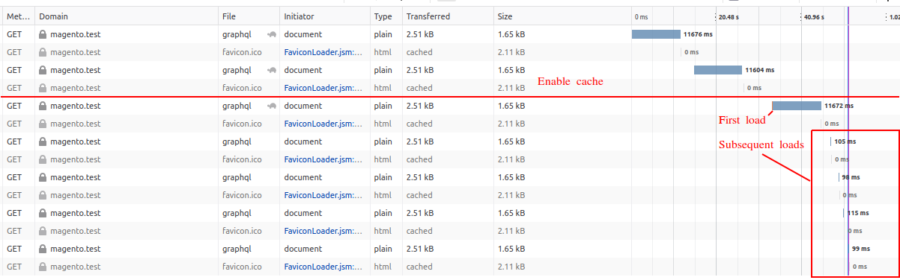

# Mage2 Module HappyHorizon PersistentGraphQlSchema

This module moves the GraphQl Schema caching to his on caching pool.
This simple cache type uses a single ./generated/graphql.schema file containing the graphql schema.

If the cache type is cleaned or removed the cache data is directly regenerated.
That saves time and resourced for subsequent calls.

Recreating the schema data can also be forced by deleting the ./generated/graphql.schema file.
Both cache:flush and cache:clean swap the file if it already exists; resulting in no downtime.

## Test without CONFIG cache

Performance gain without CONFIG cache (a quick test on development environement).
This is the case when someone flushes the configuration cache in Magento (which tends to happen a lot).

